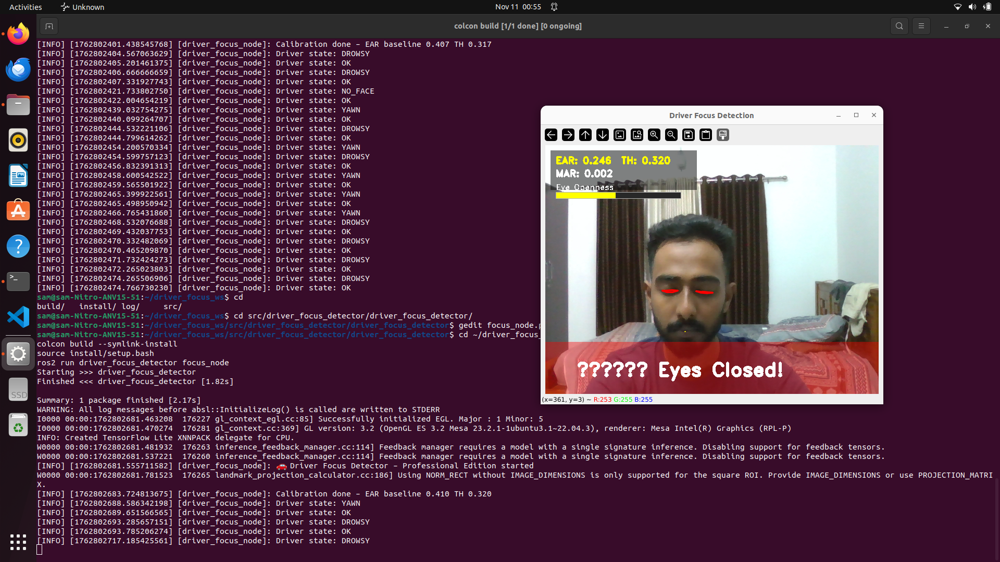

# 🚗 Driver Focus Detection (ROS 2 Humble)



A **real-time driver drowsiness and attention monitoring system** built using **ROS 2 Humble**, **OpenCV**, and **MediaPipe**.  
The system continuously analyzes the driver’s eye and mouth activity through a webcam feed to detect signs of **fatigue, eye closure, or yawning**, and publishes a warning when the driver appears drowsy.

---

## 🧠 Overview

Driver fatigue is one of the major causes of road accidents.  
This ROS 2-based project implements a **non-intrusive computer-vision pipeline** that tracks the driver’s facial landmarks in real time, calculates **Eye Aspect Ratio (EAR)** and **Mouth Aspect Ratio (MAR)**, and determines whether the driver is **alert**, **drowsy**, or **yawning**.  
When drowsiness or yawning is detected, the node raises a visual alert and publishes the current driver state to a ROS topic.

---

## ✨ Features

- 🧩 **ROS 2 Humble-compatible node** written in Python 3  
- 👁️ Real-time eye-aspect and mouth-aspect ratio computation  
- ⚙️ Automatic EAR calibration at startup  
- 🎯 Smooth, stable EAR/MAR values using rolling averages  
- 📊 Professional **HUD overlay** with:
  - EAR / MAR display  
  - Eye-openness slider bar  
  - Color-coded state alerts  
- 📢 ROS 2 topic publishing (`/driver_state`)  
- 🧱 Fully modular design for integration into autonomous or ADAS systems  
- 🪶 Lightweight and runs entirely on CPU (no GPU required)

---

## 🧰 Tech Stack

| Component | Description |
|------------|-------------|
| **ROS 2 Humble** | Middleware for real-time robotics communication |
| **OpenCV 4.x** | Video capture, image processing, and visualization |
| **MediaPipe** | Face Mesh model for accurate landmark detection |
| **Python 3.10+** | Implementation language |
| **Ubuntu 22.04 LTS** | Recommended platform |

---

## 📦 Dependencies

Install required system and Python packages:

```bash
sudo apt update
sudo apt install python3-opencv python3-pip python3-venv v4l-utils
pip install mediapipe numpy

Make sure your webcam is detected:

v4l2-ctl --list-devices

⚙️ Workspace Setup

Clone and build inside a ROS 2 workspace:

# Create and build workspace
mkdir -p ~/driver_focus_ws/src
cd ~/driver_focus_ws/src

# Clone your repository
git clone https://github.com/<yourusername>/driver_focus_detector.git

# Build the package
cd ~/driver_focus_ws
colcon build --symlink-install

# Source the workspace
source install/setup.bash

▶️ Running the Node

Launch the driver focus detection node:

ros2 run driver_focus_detector focus_node

During runtime:

    Calibration phase: look straight ahead with eyes open for 2–3 seconds.

    Detection phase: the system will display your live video feed with overlays.

🧭 Visualization Guide
Status	Visual Indicator	Description
🟢 OK	Green outlines, normal EAR	Driver alert
🔴 DROWSY	Red alert banner	Eyes closed for prolonged duration
🟠 YAWN	Orange alert banner	Mouth opened for prolonged duration
⚫ NO_FACE	Yellow message	Face not detected in frame

HUD Elements:

    EAR: Eye Aspect Ratio (eye openness)

    MAR: Mouth Aspect Ratio (yawning indicator)

    Eye Openness Slider: shows live EAR as a yellow bar

    Alert Banner: transparent color overlay when drowsiness/yawn detected

🧩 ROS 2 Integration

Published topic:

/driver_state   (std_msgs/String)

Possible values:

    OK

    DROWSY

    YAWN

    NO_FACE

This topic can be subscribed by other ROS 2 nodes such as:

    vehicle controller for lane keeping assist,

    in-car alarm or vibration system,

    data logger for driver behavior analysis.

## Project Structure

driver_focus_ws/
└── src/
    └── driver_focus_detector/
        ├── driver_focus_detector/
        │   └── focus_node.py
        ├── images/
        │   └── demo_main.png
        ├── package.xml
        ├── setup.py
        └── README.md


## 🧑‍💻 Author

Sam Shoni 
Final Year Robotics Engineering — Kerala, India
📧 samshoni10@gmail.com

🌐 LinkedIn
• GitHub
🪪 License

This project is licensed under the MIT License — you are free to use, modify, and distribute it with attribution.
